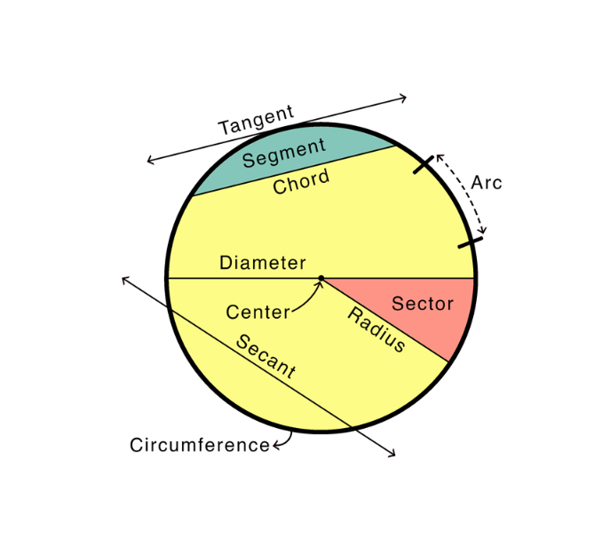

# Polygons & Circles

### 📘 Explanation:

**Polygons** are flat, closed shapes made up of straight sides. The word *polygon* means “many sides.” Every polygon is named based on how many sides it has.

#### 🔹 Common Polygons:

| Name          | Number of Sides | Visual | Example           |
| ------------- | --------------- | ------ | ----------------- |
| Triangle      | 3               | <svg width="80" height="80" viewBox="0 0 100 100"><polygon points="50,20 20,80 80,80" fill="#eaf7ff" stroke="#2a7" stroke-width="3"/></svg> | Roof truss        |
| Quadrilateral | 4               | <svg width="80" height="80" viewBox="0 0 100 100"><polygon points="25,35 75,30 80,70 20,75" fill="#eaf7ff" stroke="#2a7" stroke-width="3"/></svg> | Window            |
| Pentagon      | 5               | <svg width="80" height="80" viewBox="0 0 100 100"><polygon points="50,20 85,42 70,80 30,80 15,42" fill="#eaf7ff" stroke="#2a7" stroke-width="3"/></svg> | House roof sign   |
| Hexagon       | 6               | <svg width="80" height="80" viewBox="0 0 100 100"><polygon points="50,20 78,35 78,65 50,80 22,65 22,35" fill="#eaf7ff" stroke="#2a7" stroke-width="3"/></svg> | Honeycomb cell    |
| Heptagon      | 7               | <svg width="80" height="80" viewBox="0 0 100 100"><polygon points="50,20 68,27 80,45 72,68 28,68 20,45 32,27" fill="#eaf7ff" stroke="#2a7" stroke-width="3"/></svg> | Rare in real life |
| Octagon       | 8               | <svg width="80" height="80" viewBox="0 0 100 100"><polygon points="61,24 76,39 76,61 61,76 39,76 24,61 24,39 39,24" fill="#eaf7ff" stroke="#2a7" stroke-width="3"/></svg> | Stop sign         |
| Nonagon       | 9               | <svg width="80" height="80" viewBox="0 0 100 100"><polygon points="50,22 68,29 78,45 74,64 60,76 40,76 26,64 22,45 32,29" fill="#eaf7ff" stroke="#2a7" stroke-width="3"/></svg> | Fancy tile design |
| Decagon       | 10              | <svg width="80" height="80" viewBox="0 0 100 100"><polygon points="50,22 66,27 77,41 77,59 66,73 50,78 34,73 23,59 23,41 34,27" fill="#eaf7ff" stroke="#2a7" stroke-width="3"/></svg> | Coin edge pattern |

#### 🔹 Key Polygon Facts:

* The **sum of interior angles** = (number of sides − 2) × 180°.
  Example: Pentagon → (5 − 2) × 180 = 540°.

**Interior Angles Visualization:**

<svg width="220" height="180" viewBox="0 0 220 180">
  <!-- Pentagon -->
  <polygon points="110,30 180,70 155,140 65,140 40,70" fill="#eaf7ff" stroke="#2a7" stroke-width="3"/>
  <!-- Interior angles marked -->
  <circle cx="110" cy="30" r="3" fill="#ff6b6b"/>
  <circle cx="180" cy="70" r="3" fill="#ff6b6b"/>
  <circle cx="155" cy="140" r="3" fill="#ff6b6b"/>
  <circle cx="65" cy="140" r="3" fill="#ff6b6b"/>
  <circle cx="40" cy="70" r="3" fill="#ff6b6b"/>
  <text x="110" y="165" font-size="14" fill="#333" text-anchor="middle" font-weight="bold">Pentagon: (5 − 2) × 180° = 540°</text>
</svg>

* The **exterior angles** always add up to **360°** (one full turn).

**Exterior Angles Visualization:**

<svg width="220" height="180" viewBox="0 0 220 180">
  <!-- Hexagon with exterior angles -->
  <polygon points="110,30 160,50 160,100 110,120 60,100 60,50" fill="#eaf7ff" stroke="#2a7" stroke-width="3"/>
  <!-- Exterior angle lines -->
  <line x1="110" y1="30" x2="110" y2="5" stroke="#ff6b6b" stroke-width="2.5"/>
  <line x1="160" y1="50" x2="185" y2="40" stroke="#ff6b6b" stroke-width="2.5"/>
  <line x1="160" y1="100" x2="185" y2="110" stroke="#ff6b6b" stroke-width="2.5"/>
  <line x1="110" y1="120" x2="110" y2="145" stroke="#ff6b6b" stroke-width="2.5"/>
  <line x1="60" y1="100" x2="35" y2="110" stroke="#ff6b6b" stroke-width="2.5"/>
  <line x1="60" y1="50" x2="35" y2="40" stroke="#ff6b6b" stroke-width="2.5"/>
  <text x="110" y="170" font-size="14" fill="#333" text-anchor="middle" font-weight="bold">All exterior angles = 360°</text>
</svg>

* A **regular polygon** has all sides and angles equal.
* In a regular polygon:

  * Each interior angle = [(n − 2) × 180] ÷ n
  * Each exterior angle = 360 ÷ n

---

### 🟣 Circles

A **circle** is a special curved 2D shape where all points are **the same distance** from a centre.

[Video explanation](https://www.youtube.com/watch?v=WdFacLv-h3o&source_ve_path=MTc4NDI0)

| Term                  | Meaning                                            | Example               |
| --------------------- | -------------------------------------------------- | --------------------- |
| **Radius (r)**        | Distance from centre to edge                       | Half a pizza slice    |
| **Diameter (d)**      | Line across the circle through the centre (d = 2r) | Width of a coin       |
| **Circumference (C)** | Distance around the edge                           | Rim of a wheel        |
| **Chord**             | A line joining two points on the circle            | Guitar string segment |
| **Arc**               | Part of the circumference                          | Edge of a slice       |
| **Sector**            | “Piece of pizza” between two radii                 |                       |
| **Tangent**           | Line that touches the circle at one point only     |                       |

**Important Formulas:**

<svg width="260" height="180" viewBox="0 0 260 180">
  <!-- Circle for circumference -->
  <circle cx="70" cy="60" r="40" fill="#eaf7ff" stroke="#2a7" stroke-width="3"/>
  <line x1="70" y1="60" x2="110" y2="60" stroke="#ff6b6b" stroke-width="2.5"/>
  <text x="90" y="55" font-size="11" fill="#ff6b6b" font-weight="bold">r</text>
  <text x="70" y="115" font-size="12" fill="#333" font-weight="bold" text-anchor="middle">C = 2πr</text>
  <text x="70" y="130" font-size="11" fill="#555" text-anchor="middle">or πd</text>
  
  <!-- Circle for area -->
  <circle cx="180" cy="60" r="40" fill="#eaf7ff" stroke="#2a7" stroke-width="3"/>
  <line x1="180" y1="60" x2="180" y2="20" stroke="#ff6b6b" stroke-width="2.5"/>
  <text x="185" y="40" font-size="11" fill="#ff6b6b" font-weight="bold">r</text>
  <text x="180" y="115" font-size="12" fill="#333" font-weight="bold" text-anchor="middle">A = πr²</text>
  
  <!-- Note -->
  <text x="130" y="160" font-size="13" fill="#2a7" font-weight="bold" text-anchor="middle">For 11+ exams: π ≈ 3.14 or 22/7</text>
</svg>

* Circumference = π × diameter = 2 × π × radius
* Area = π × r²
* For 11+ exams, use π ≈ 3.14 or 22/7.

#### 🧭 Common Mistakes to Avoid:

* Confusing diameter and radius (radius is half).
* Forgetting π in circumference or area.
* Thinking polygons can have curved sides (they can’t).
* Mixing interior and exterior angle formulas.

---

### 🧮 Examples:

1. **Finding angle sum**

   * Hexagon → (6 − 2) × 180 = **720°**.
   * Common mistake: multiplying 6 × 180 directly.

2. **Each interior angle of a regular octagon**

   * (8 − 2) × 180 ÷ 8 = 6 × 180 ÷ 8 = 1080 ÷ 8 = **135°**.

3. **Finding number of sides**

   * A regular polygon has interior angle 120°.
     (n − 2) × 180 ÷ n = 120 → 180n − 360 = 120n → 60n = 360 → **n = 6** (hexagon).

4. **Circle circumference**

   * Radius = 7 cm → C = 2 × π × 7 ≈ 44 cm.

5. **Circle area**

   * Radius = 5 cm → A = π × 5² = 25π ≈ 78.5 cm².

---

### 🧩 Word Problems:

#### 🔹 Easy

1. A pentagon has how many sides?
2. A regular hexagon has equal sides and equal what?
3. The sum of angles in a triangle is 180°. What is it for a quadrilateral?
4. Find the radius of a circle with diameter 10 cm.
5. What do you call a line from the centre to the edge of a circle?
6. A circle’s radius is 6 cm. Find its diameter.
7. A regular octagon has how many sides?
8. The circumference of a circle is about 31.4 cm. What is its radius (π ≈ 3.14)?
9. A regular pentagon’s interior angles add to what?
10. A shape with 8 equal sides and angles is called what?

#### 🔸 Medium

11. Find the sum of angles in a decagon.
12. A circle has a diameter of 14 cm. Find its circumference.
13. A circle has radius 10 cm. Find its area (π = 3.14).
14. A regular hexagon has interior angle 120°. Find its exterior angle.
15. How many sides has a regular polygon if each exterior angle = 45°?
16. The radius of a wheel is 35 cm. Find its circumference (π = 22/7).
17. The radius of a circular pond is 4 m. Find the area.
18. A clock face is a circle. What is the angle turned by the minute hand from 12 to 3?
19. The interior angles of a polygon total 900°. How many sides does it have?
20. The radius of a coin is 1.5 cm. Find its diameter and approximate circumference.

#### 🔺 Hard

21. A regular polygon has each interior angle = 150°. How many sides does it have?
22. A circle has circumference 62.8 cm. Find its diameter.
23. A regular polygon’s exterior angle = 40°. Find the number of sides and the interior angle.
24. A circle has area 154 cm². Find its radius (π = 22/7).
25. A regular hexagon has side length 8 cm. Find its perimeter.
26. A circular garden has diameter 14 m. Find its area (π = 22/7).
27. A regular polygon has 9 sides. Find its interior and exterior angles.
28. The sum of all angles in a 12-sided polygon is what?
29. A wheel has radius 35 cm. How far does it roll in 10 turns?
30. A circle’s radius doubles. How does its area and circumference change?

---

### ✅ Answers:

1. 5

2. Angles

3. 360°

4. 5 cm

5. Radius

6. 12 cm

7. 8

8. 31.4 ÷ (2×3.14) = 5 cm

9. (5−2)×180 = 540°

10. Octagon

11. (10−2)×180 = 1440°

12. 3.14 × 14 = 43.96 cm

13. 3.14 × 10² = 314 cm²

14. 60° (180−120)

15. 360 ÷ 45 = 8 sides

16. 2×22/7×35 = 220 cm

17. 3.14 × 4² = 50.24 m²

18. 90° (quarter of 360°)

19. (n−2)×180=900 → n=7 sides

20. Diameter = 3 cm; circumference ≈ 2×3.14×1.5 = 9.42 cm

21. (n−2)×180/n=150 → 180n−360=150n → 30n=360 → n=12 sides

22. 62.8 ÷ 3.14 = 20 cm

23. Exterior = 40° → n=360/40=9 → Interior=180−40=140°

24. πr²=154 → r²=154×7/22=49 → r=7 cm

25. 8×6=48 cm

26. (22/7)×7²=154 m²

27. Interior=(9−2)×180/9=140°; exterior=40°

28. (12−2)×180=1800°

29. Circumference per turn=2×π×35≈220 cm → 220×10=2200 cm=22 m

30. Area ×4 (since r²), circumference ×2 (since r doubles).

---

