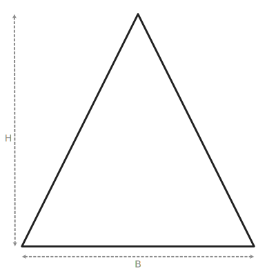

import TwoColumn from '@site/src/components/TwoColumn';

# Ultimate math revision

<TwoColumn>
  <>
  ### 🍰 Fractions – Visual Side

  A fraction represents **equal parts of a whole**.

  - Top number (numerator): parts you have  
  - Bottom number (denominator): total parts  

  Inline SVG works here too:

  <svg
    width="140"
    height="40"
    viewBox="0 0 140 40"
    aria-label="Fraction bar"
  >
    <rect x="0" y="10" width="140" height="20" fill="#B3E5FC" />
    <rect x="0" y="10" width="70" height="20" fill="#4DD0E1" />
    <text
      x="70"
      y="36"
      textAnchor="middle"
      fontSize="12"
      fontFamily="sans-serif"
    >
      {'1/2'}
    </text>
  </svg>
  </>

  <>
  ### 🧠 Fractions – Explanation

  Think of a pizza cut into **8 equal slices**:

  - 3 slices eaten → **3/8**  
  - 4 slices eaten → **1/2**  

  > **Exam Tip:** In 11+ questions, they love asking:
  > - Which is bigger: `3/8` or `1/4`?  
  >   Convert to a common denominator or decimals.

</>
</TwoColumn>

## Triangle

<TwoColumn>
  <>
  
  

  </>

  <>
  ### 📏 Key Properties

  - Triangle angles add to **180°**  
  - Square angles are **90°** each  
  - Rectangle angles are **90°** each  
  - Circle circumference = π × diameter
  </>
</TwoColumn>

# Data

## Mean, Median, Mode, Range

| Concept            | What It Means        | How to Calculate                   | Example                    |
| ------------------ | -------------------- | ---------------------------------- | -------------------------- |
| **Mean (Average)** | Equal share of total | Add all numbers ÷ how many numbers | (3, 6, 9) → 18 ÷ 3 = **6** |
| **Median**         | Middle number        | Put in order → choose middle       | (2, 4, 7) → **4**          |
| **Mode**           | Most common value    | Count frequency                    | (1, 2, 2, 4) → **2**       |
| **Range**          | Spread of data       | Largest – smallest                 | (3, 10) → **7**            |
