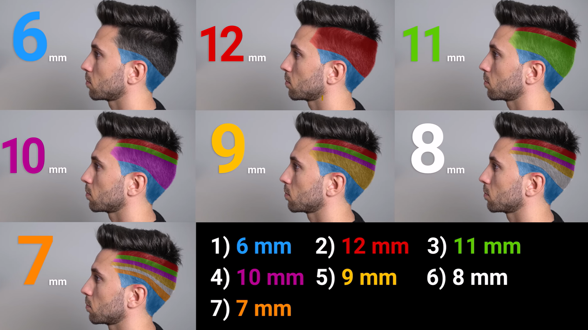

# Hair cutting for men
---

Reference video on [Learn to Cut Your Own Hair At Home](https://www.youtube.com/watch?v=DSZCH2mlz_M&t=212s)

## Essential Steps for the Haircut

The overall goal described in the sources is to achieve a faded look, where the hair is short around the ears and gradually longer on top.

**1. Preparation**
You must wash your hair first, as this makes the hair much easier to cut.

**2. Cutting the Sides and Back (Fading)**
This process is achieved in levels, always remembering to go **"up and out"** when using the clippers,. Applying a lot of pressure is not necessary.

*   **First Level (Shortest):** Start by using the **6-millimeter guide** on the area around the ears and sides. The source recommends retouching the same area three times to ensure all hairs are the same length.
*   **Second Level (Longer):** Begin cutting the next level using the **12-millimeter guide**.
*   **Blending the Fade:** To fix the line between the 6 mm and 12 mm lengths, you must progressively decrease the cut length using guides in the middle range. When decreasing the cut length, you cover the entire area of the guide used previously, but leave out a small band on top. The process described involves fading from 6 to 12 millimeters using guides like the 11-millimeter guide and finally the 7-millimeter guide,.

**3. Cleaning Edges**
Before moving to the top, clean out the hair around the ear and the neck. This step is "a bit tricky," and if you are not used to it, you should be very careful or ask someone in your house to help you out,.

**4. Cutting the Top**
If your hair is dry, you should wash it again.

*   Grab the first section of hair with your fingers and pull it up.
*   Cut off a little bit, depending on how much you want to shorten the hair.
*   Move section by section toward the back of your head, using the hair already cut as a guide.
*   Keep the hair on the back "pretty short".

**6. Final Step**
After the cuts are completed, take a shower.

## Necessary Tools

1.  **Hair Clipper:** A good hair clipper is required, and it should include a switch for micro-adjusting the cut length.
2.  **Combs/Guides:** Clipper guides that cover a length range from **4 to 12 millimeters** are necessary.
3.  **Comb:** A standard comb is needed, especially if you have longer hair,.
4.  **Scissors**.
5.  **Mirrors:** You need **a big mirror** and **a small mirror**. The small mirror is used while viewing your reflection in the big mirror to see the back and sides of your head.
