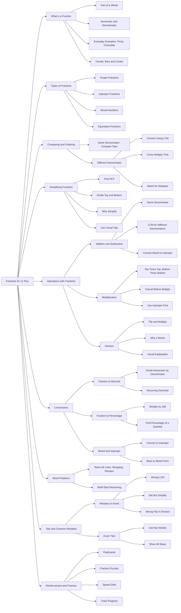

# Revision

## Mind map

```mermaid
graph LR;
  A[Fractions for 11 Plus];

  %% Basic Concepts
  A --> A1[What is a Fraction];
  A1 --> A1a[Part of a Whole];
  A1 --> A1b[Numerator and Denominator];
  A1 --> A1c[Everyday Examples: Pizza, Chocolate];
  A1 --> A1d[Visuals: Bars and Circles];

  A --> A2[Types of Fractions];
  A2 --> A2a[Proper Fractions];
  A2 --> A2b[Improper Fractions];
  A2 --> A2c[Mixed Numbers];
  A2 --> A2d[Equivalent Fractions];

  %% Comparing & Ordering
  A --> B[Comparing and Ordering];
  B --> B1[Same Denominator: Compare Tops];
  B --> B2[Different Denominator];
  B2 --> B2a[Convert Using LCM];
  B2 --> B2b[Cross-Multiply Trick];
  B2 --> B2c[Watch for Mistakes];

  %% Simplifying
  A --> C[Simplifying Fractions];
  C --> C1[Find HCF];
  C --> C2[Divide Top and Bottom];
  C --> C3[Why Simplify];
  C --> C4[Use Visual Tips];

  %% Operations
  A --> D[Operations with Fractions];
  D --> D1[Addition and Subtraction];
  D1 --> D1a[Same Denominator];
  D1 --> D1b[LCM for Different Denominators];
  D1 --> D1c[Convert Mixed to Improper];

  D --> D2[Multiplication];
  D2 --> D2a[Top Times Top, Bottom Times Bottom];
  D2 --> D2b[Cancel Before Multiply];
  D2 --> D2c[Use Improper First];

  D --> D3[Division];
  D3 --> D3a[Flip and Multiply];
  D3 --> D3b[Why it Works];
  D3 --> D3c[Visual Explanation];

  %% Conversions
  A --> E[Conversions];
  E --> E1[Fraction to Decimal];
  E1 --> E1a[Divide Numerator by Denominator];
  E1 --> E1b[Recurring Decimals];

  E --> E2[Fraction to Percentage];
  E2 --> E2a[Multiply by 100];
  E2 --> E2b[Find Percentage of a Quantity];

  E --> E3[Mixed and Improper];
  E3 --> E3a[Convert to Improper];
  E3 --> E3b[Back to Mixed Form];

  %% Word Problems
  A --> F[Word Problems];
  F --> F1[Real-Life Uses: Shopping, Recipes];
  F --> F2[Multi-Step Reasoning];

  %% Tips and Mistakes
  A --> G[Tips and Common Mistakes];
  G --> G1[Mistakes to Avoid];
  G1 --> G1a[Wrong LCM];
  G1 --> G1b[Did Not Simplify];
  G1 --> G1c[Wrong Flip in Division];

  G --> G2[Exam Tips];
  G2 --> G2a[Use Bar Models];
  G2 --> G2b[Show All Steps];

  %% Reinforcement
  A --> H[Reinforcement and Practice];
  H --> H1[Flashcards];
  H --> H2[Fraction Puzzles];
  H --> H3[Speed Drills];
  H --> H4[Track Progress];

```